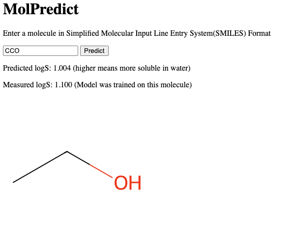
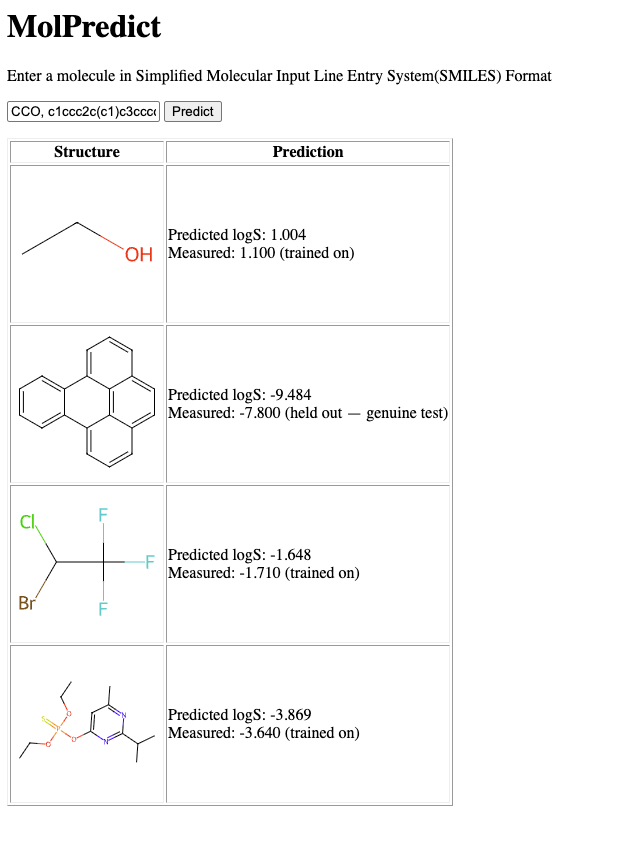

 # MolPredict

  Predicts the **aqueous solubility (logS)** of small molecules from their SMILES string — a PyTorch model wrapped in
  a REST API, a web UI, an async batch queue, and deployed on Kubernetes with monitoring.

  > Built as an end-to-end machine-learning systems project: from featurizing molecules to serving predictions in a
  containerized, observable microservice.

  <p align="center">
    
  </p>

  ---
  
  ## What it does

  Given a molecule as a [SMILES](https://en.wikipedia.org/wiki/Simplified_molecular-input_line-entry_system) string
  (e.g. `CCO` for ethanol), MolPredict:

  - predicts its **log solubility** in water (logS, mol/L),
  - draws the molecular structure,
  - reports the **measured** value when the molecule is in the reference dataset — and differentiates if it was
  **trained on** or **held out**, so you can tell if that was more of a memorization or an actual prediction,
  - and handles **batches** of molecules asynchronously via a job queue.

  <p align="center">
    
  </p>


  ## Architecture
  
  ```
  Browser  (static/index.html + app.js)
     │  POST /predict         → synchronous single prediction
     │  POST /predict/batch   → async: returns a job_id, UI polls /jobs/{id}
     ▼
  FastAPI (app.py) ──► RDKit featurization + PyTorch model (model.pt) ──► logS
     │                            ▲
     │ enqueue job                │ result
     ▼                            │
  Redis queue ──────► RQ worker (worker.py) ──────────┘

  Packaging:     Docker · docker-compose · Kubernetes (k8s/)
  Observability: /metrics ──► Prometheus ──► Grafana
  ```

  ## Tech stack
  
  **ML:** PyTorch · RDKit · NumPy · pandas
  **Service:** FastAPI · Redis + RQ (async jobs) · vanilla JS front-end
  **Infra:** Docker · docker-compose · Kubernetes (minikube)
  **Ops:** Prometheus + Grafana · pytest · GitHub Actions CI · Dependabot

  ## The model

  | | |
  |---|---|
  | **Task** | Aqueous solubility (logS), regression |
  | **Dataset** | Estimated Solubility(ESOL) — 1,128 molecules (902 train / 226 validation) |
  | **Features** | Morgan fingerprints, radius 2, 2048 bits (RDKit) |
  | **Model** | The Multilayer Perceptron(MLP): 2048 → 512 → 128 → 1 (PyTorch) |
  | **Validation RMSE** | **1.11 logS** (mean-guess baseline: 2.07) |
  | **Validation R²** | **≈ 0.71** |

  Reproduce training and evaluation:
  
  ```bash
  python train.py      # trains and writes model.pt
  python evaluate.py   # prints RMSE, baseline, and R² on the held-out set
  ```

  ## API reference

  | Method | Path | Purpose |
  |---|---|---|
  | `POST` | `/predict` | Single-molecule prediction (synchronous) |
  | `POST` | `/predict/batch` | Enqueue a batch job → returns a `job_id` |
  | `GET`  | `/jobs/{job_id}` | Poll a batch job's status and result |
  | `GET`  | `/draw?smiles=...` | Render a molecule's structure as SVG |
  | `GET`  | `/healthz` | Liveness check |
  | `GET`  | `/metrics` | Prometheus metrics |
  | `GET`  | `/` | Web UI |

  Example:
  
  ```bash
  curl -X POST localhost:8000/predict \
    -H "Content-Type: application/json" \
    -d '{"smiles": "CCO"}'
  # → {"smiles":"CCO","logS":1.00,"measured":{"measured":1.1,"in_training":true}}
  ```

  ## Getting started
  
  ### Option A — Docker Compose (easiest)

  Brings up the API, worker, and Redis together:

  ```bash
  docker compose up --build
  # open http://localhost:8000
  ```

  ### Option B — Kubernetes (minikube)

  ```bash
  docker build -t molpredict:latest .
  minikube image load molpredict:latest
  kubectl apply -f k8s/
  kubectl port-forward deployment/molpredict-api 8000:8000
  # open http://localhost:8000
  ```

  ### Option C — Local development

  Requires three processes running together — the API, a worker, and Redis:

  ```bash
  # 1. Redis (via Docker, or a local install)
  docker run -p 6379:6379 redis:7

  # 2. API
  uvicorn app:app --reload
  
  # 3. Worker (separate terminal)
  rq worker
  ```

  > **Note:** batch predictions need the worker running. If single predictions work but batches hang, a worker (or
  Redis) isn't up.

  ## Testing
  
  ```bash
  pip install -r requirements-dev.txt
  pytest
  ```

  CI runs the test suite on every push via GitHub Actions.

  ## Monitoring

  The API exposes Prometheus metrics at `/metrics`. A `ServiceMonitor` (`k8s/servicemonitor.yaml`) lets a
  Prometheus/Grafana stack scrape and graph request rates, latencies, and errors.

  ## Project structure
  
  ```
  features.py        SMILES → Morgan fingerprints (+ molecule drawing)
  train.py           Trains the MLP, writes model.pt
  predict.py         Loads model.pt and predicts logS
  evaluate.py        RMSE / baseline / R² on the validation split
  measured.py        Looks up measured solubility + train/test membership
  app.py             FastAPI app (endpoints above)
  worker.py          RQ task for async batch prediction
  static/            Web UI (index.html + app.js)
  Dockerfile         Container image (installs RDKit's system libs)
  docker-compose.yml api + worker + redis
  k8s/               Kubernetes manifests (api, worker, redis, servicemonitor)
  test_app.py        pytest suite
  ```

  ## Limitations & future work
  
  - Trained only on ESOL — a small, single-source dataset; more functional solubility models would use far more data and richer
  descriptors.
  - MLP is a solid baseline, not a state-of-the-art (e.g. graph neural network) architecture.
  - Not production-hardened: no authentication, only a single pod, the model can only be retrained with a redeploy of the entire image.

  Built as a learning project to practice the full lifecycle of a machine-learning service.
  ```

